# Factor Engine — Architecture Reference

> **Generated**: 2026-02-28 | **Version**: 0.1.0 | **Python**: ≥ 3.12

---

## 1. System Overview

Factor Engine is an AI-powered quantitative factor research platform that automatically generates tradable equity factors from natural-language investment themes. The system operates as a **three-stage pipeline** backed by a FastAPI service layer and a Next.js frontend.

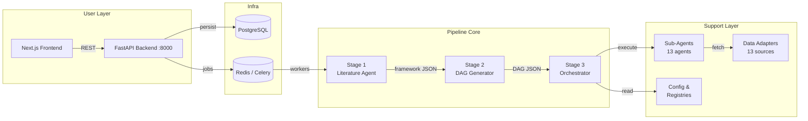

---

## 2. Repository Layout

```
factor_engine/
├── backend/                    # FastAPI + Celery application
│   ├── app/
│   │   ├── api/v1/             # REST endpoints (factors, universes, agents, dags, health)
│   │   ├── db/                 # SQLAlchemy models & repository
│   │   ├── models/             # Pydantic request/response schemas
│   │   ├── jobs/               # Celery background jobs
│   │   └── services/           # Business logic
│   └── pyproject.toml
│
├── packages/
│   ├── literature_agent/       # Stage 1 — theme → mathematical framework
│   ├── dag_generator/          # Stage 2 — framework → executable DAG
│   ├── orchestrator/           # Stage 3 — DAG → executed factor
│   ├── sub_agents/             # 13 specialized execution agents
│   └── data_adapters/          # 13+ external data source adapters
│
├── config/
│   ├── factor_agent.yaml       # Master execution config
│   ├── observability.yaml      # Logging & metrics
│   ├── rate_limits.yaml        # API rate limits
│   └── registries/             # Agent & adapter YAML registries
│
├── frontend/                   # Next.js web application
├── data/                       # Universes, cache, outputs
├── docker/                     # Docker Compose
└── pyproject.toml              # uv workspace root
```

---

## 3. Three-Stage Pipeline

The core value proposition: turn an **investment theme** (plain English) into a **scored, tradable equity factor** — fully automated.

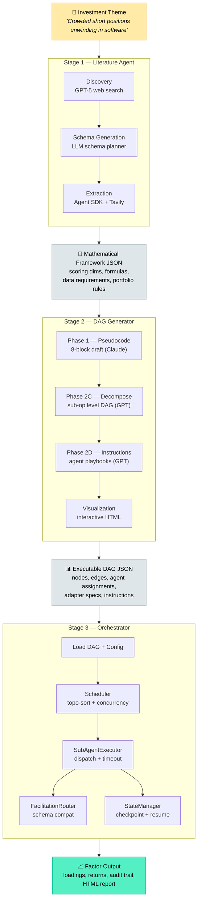

---

## 4. Package Deep-Dives

### 4.1 Literature Agent (`packages/literature_agent/`)

Transforms an investment theme into a structured mathematical framework via three sub-stages.

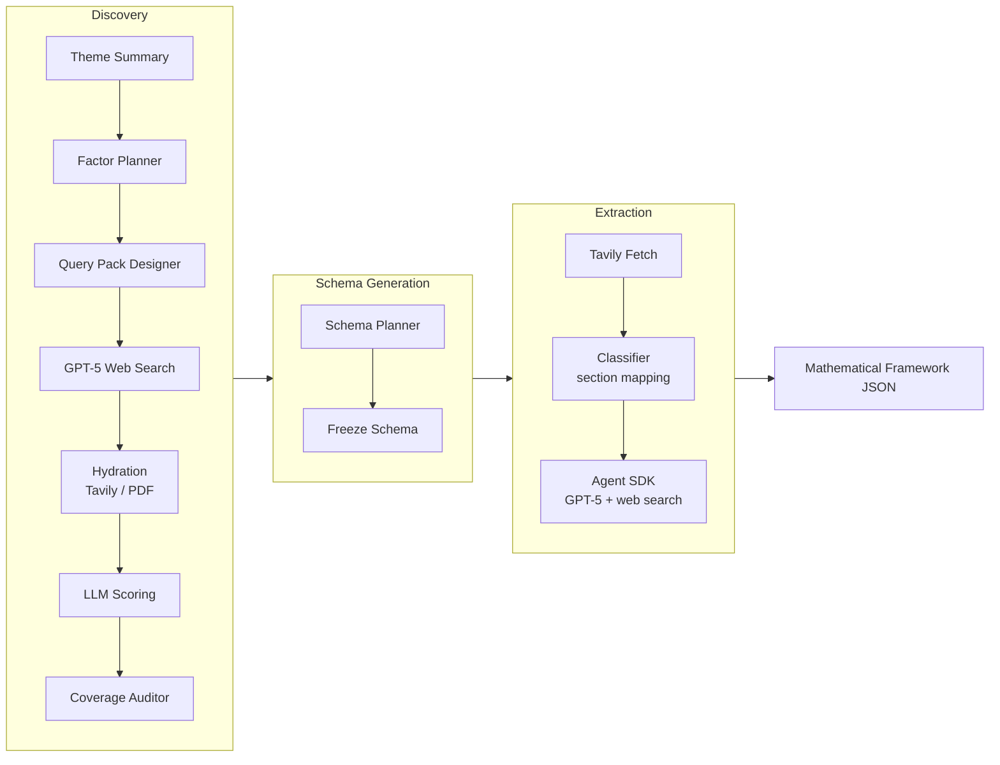

**Key capabilities**:
- **Discovery**: GPT-5 web search across 4 segments (INDEX_METHOD, ACADEMIC, STANDARDS, ECOSYSTEM) with coverage auditing and backfill
- **Schema Generation**: LLM-planned extraction schema with thinking modes (fast / balanced / deep)
- **Extraction**: Agent SDK autonomous research with confidence guardrails and implementability filtering
- **Resume support**: Each stage checks for prior outputs before re-running

---

### 4.2 DAG Generator (`packages/dag_generator/`)

Converts a mathematical framework into an executable DAG through a multi-phase LLM pipeline.

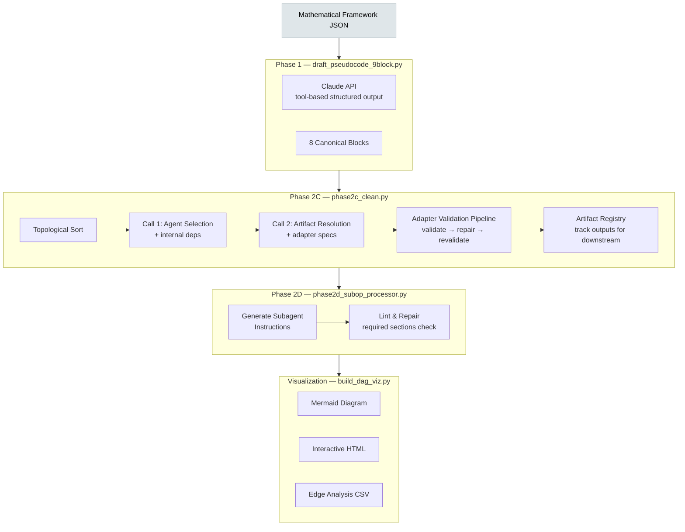

**8 canonical blocks** (execution order):

| # | Block | Purpose |
|---|-------|---------|
| 1 | `universe_tradability` | Universe selection + liquidity/market-cap filters |
| 2 | `extraction` | Raw data pull (patents, SEC, news, fundamentals) |
| 3 | `classification` | Document/entity classification by theme relevance |
| 4 | `scoring_llm` | LLM-based scoring (sentiment, relevance) |
| 5 | `scoring_formula` | Formula-based scoring (z-scores, dimensions) |
| 6 | `aggregation` | Combine dimension scores into composite |
| 7 | `weights` | Portfolio weights with constraints |
| 8 | `output` | Final outputs + audit trail |

**Adapter validation pipeline**:
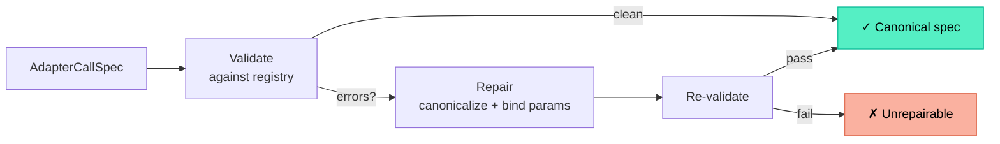

---

### 4.3 Orchestrator (`packages/orchestrator/`)

The execution engine: loads a DAG, schedules operations respecting dependencies and rate limits, dispatches to sub-agents, and manages state.

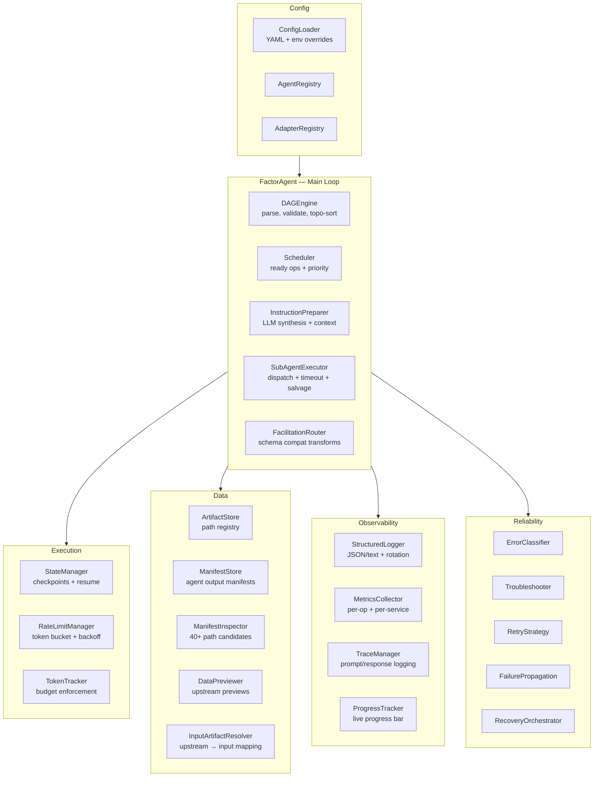

**Execution flow for a single operation**:

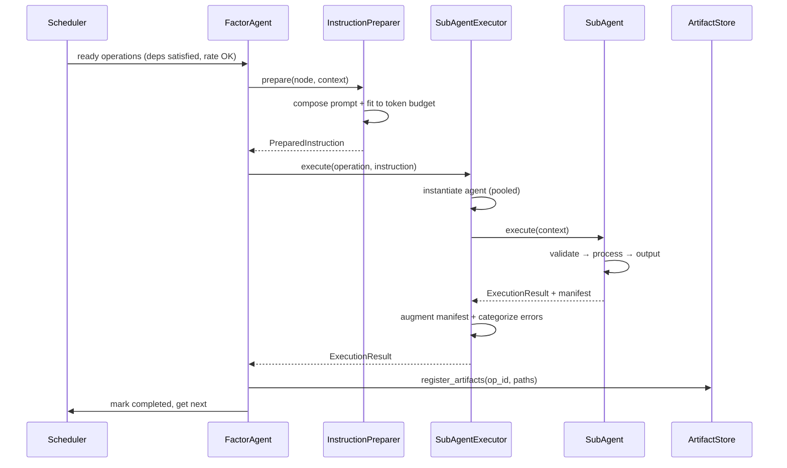

---

### 4.4 Sub-Agents (`packages/sub_agents/`)

13 specialized agents organized in a class hierarchy.

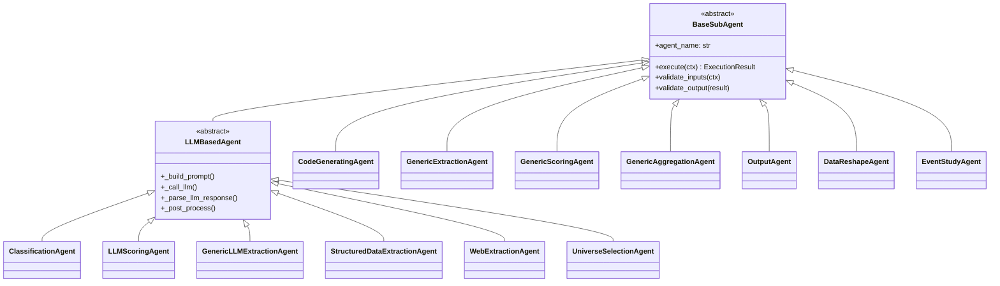

**Agent capabilities matrix**:

| Agent | Category | LLM? | Key Capability |
|-------|----------|------|----------------|
| `CodeGeneratingAgent` | transformation | yes | LangGraph reflection loop, sandbox exec, gpt-5.2 |
| `GenericExtractionAgent` | extraction | partial | Adapter-driven data pull, semantic column matching |
| `GenericScoringAgent` | scoring | yes | Claude CGA delegation, stage-based execution |
| `GenericAggregationAgent` | aggregation | yes | Claude CGA, component discovery, null propagation |
| `OutputAgent` | output | optional | Multi-format (CSV/Parquet/JSON/HTML), audit trails |
| `DataReshapeAgent` | transformation | yes | LangGraph, schema analysis, sandbox exec |
| `EventStudyAgent` | analysis | optional | Abnormal returns, CARs, SCARs, event betas |
| `ClassificationAgent` | classification | yes | Dynamic label schema inference, structured output |
| `LLMScoringAgent` | scoring | yes | Dynamic scoring schema, batch processing, token budgets |
| `GenericLLMExtractionAgent` | extraction | yes | Schema inference + structured extraction |
| `StructuredDataExtractionAgent` | extraction | yes | Three-phase: infer → synthesize → extract |
| `WebExtractionAgent` | extraction | yes | Hybrid: Tavily discovery + structured extraction |
| `UniverseSelectionAgent` | selection | yes | Multi-stage filtering, web search thematic screening |

**Common execution patterns**:

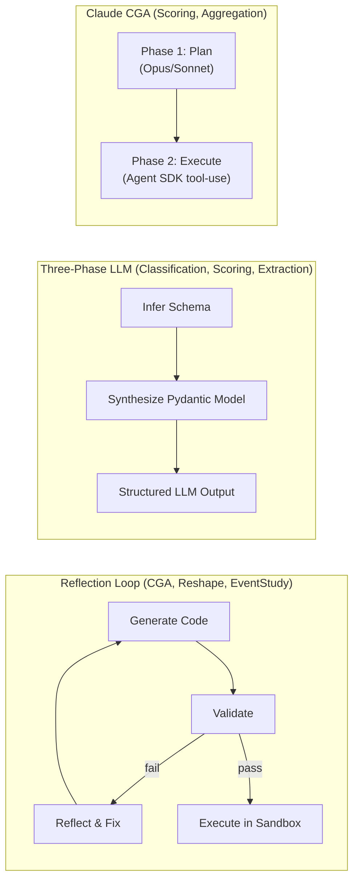

---

### 4.5 Data Adapters (`packages/data_adapters/`)

Unified interface to 13+ external data sources. All inherit from `BaseAdapter` with shared caching, rate limiting, and Point-in-Time (PTI) filtering.

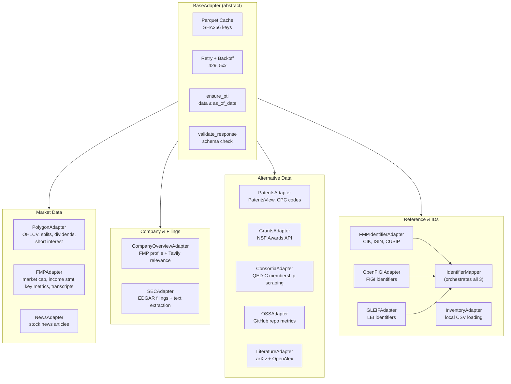

**External API dependencies**:

| Adapter | API | Auth |
|---------|-----|------|
| PolygonAdapter | api.polygon.io | API key |
| FMPAdapter | financialmodelingprep.com | API key |
| NewsAdapter | FMP /stable/news/stock | API key |
| CompanyOverviewAdapter | FMP + Tavily | API keys |
| SECAdapter | EDGAR + FMP + Tavily | API keys |
| PatentsAdapter | search.patentsview.org | API key |
| GrantsAdapter | research.gov (NSF) | none |
| ConsortiaAdapter | quantumconsortium.org | none (+ OpenAI for symbols) |
| OSSAdapter | api.github.com | token (optional) |
| LiteratureAdapter | arXiv + OpenAlex | none |
| OpenFIGIAdapter | api.openfigi.com | optional |
| GLEIFAdapter | api.gleif.org | none |
| InventoryAdapter | local filesystem | none |

---

## 5. Configuration System

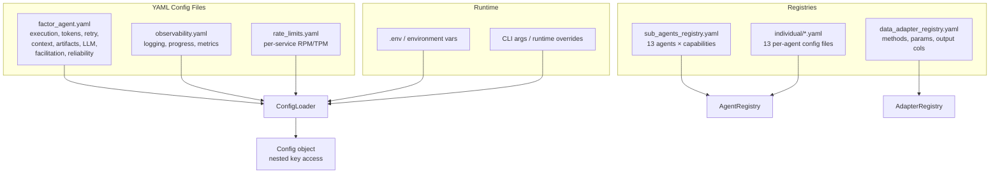

**Key config sections** (`factor_agent.yaml`):

| Section | Controls |
|---------|----------|
| `execution` | max_concurrent (8), checkpoint freq, timeout defaults |
| `token_budget` | per-op warning (10K), limit (50K), session (1M) |
| `retry` | max attempts by ErrorCategory, exponential backoff |
| `artifacts` | storage paths, compression (gzip:6), max size (500MB), retention (30d) |
| `llm` | default provider (openai), model (gpt-5.2), max tokens (100K) |
| `facilitation` | transform detection (rename, pivot, aggregate, unpivot) |
| `reliability` | error classification, troubleshooting, recovery agents |
| `extraction` | base period (1yr), quarterly rebalance, adapter lookback windows |

---

## 6. Observability Stack

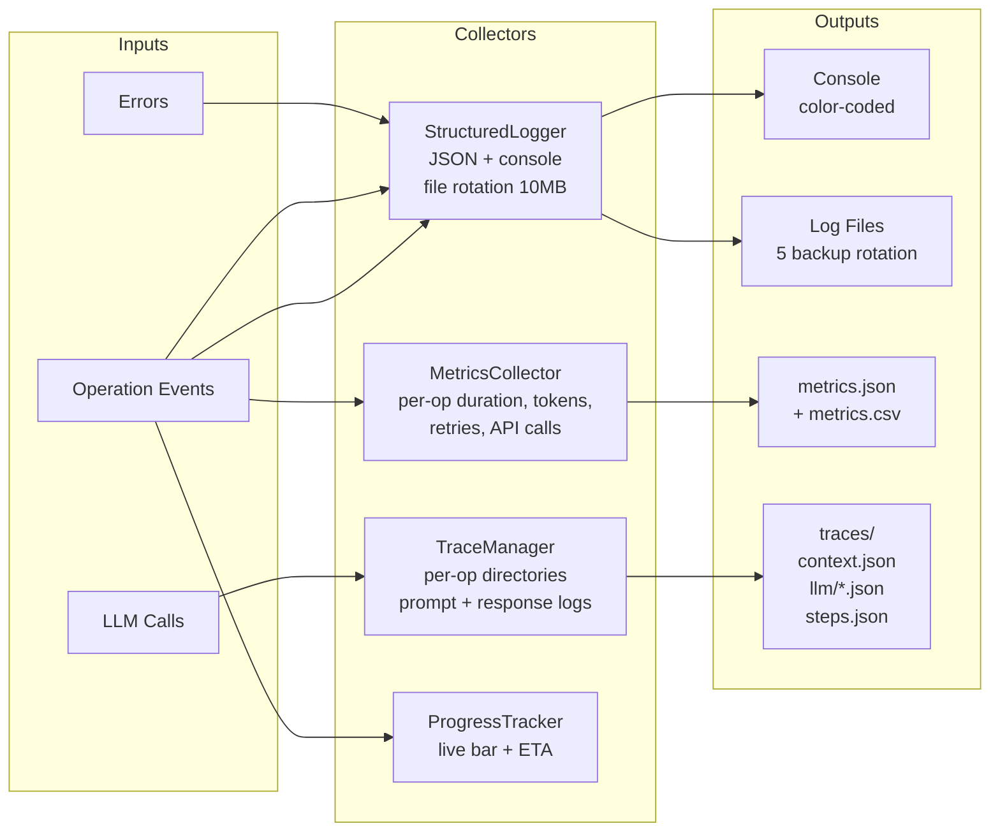

---

## 7. Reliability & Error Handling

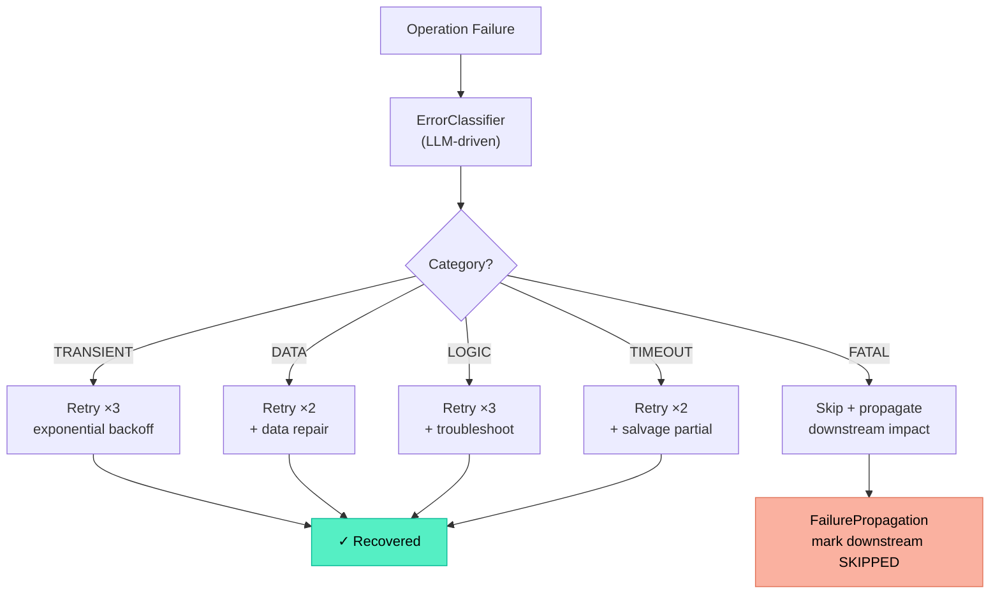

---

## 8. Data Flow — End to End

```mermaid
flowchart TB
    USER["User: 'Build a factor capturing<br/>crowded short positions unwinding'"]

    subgraph S1["Stage 1: Literature Agent"]
        DISC["Discover 50+ sources<br/>across 4 segments"]
        SCHEMA["Plan extraction schema<br/>(5-10 sections)"]
        EXTRACT["Extract mathematical<br/>framework via Agent SDK"]
    end

    FW2["Framework JSON<br/>• scoring dimensions & formulas<br/>• data requirements<br/>• portfolio construction rules<br/>• tradability filters"]

    subgraph S2["Stage 2: DAG Generator"]
        PSEUDO["Generate 8-block<br/>pseudocode (Claude)"]
        DECOMP["Decompose into ~30-50<br/>sub-operations (GPT)"]
        PLAY["Generate agent<br/>playbooks (GPT)"]
    end

    DAG2["DAG JSON<br/>• 30-50 nodes<br/>• dependency edges<br/>• agent assignments<br/>• adapter call specs<br/>• subagent instructions"]

    subgraph S3["Stage 3: Orchestrator"]
        TOPO2["Topological schedule"]
        direction TB
        EX1["universe_tradability<br/>→ UniverseSelectionAgent"]
        EX2["extraction (×N)<br/>→ GenericExtractionAgent"]
        EX3["classification<br/>→ ClassificationAgent"]
        EX4["scoring_llm<br/>→ LLMScoringAgent"]
        EX5["scoring_formula<br/>→ CodeGeneratingAgent"]
        EX6["aggregation<br/>→ GenericAggregationAgent"]
        EX7["weights<br/>→ CodeGeneratingAgent"]
        EX8["output<br/>→ OutputAgent"]
        TOPO2 --> EX1 --> EX2 --> EX3 --> EX4 --> EX5 --> EX6 --> EX7 --> EX8
    end

    RESULT["Factor Output<br/>• factor_loadings.parquet<br/>• factor_returns.parquet<br/>• audit_trail.json<br/>• report.html"]

    USER --> S1
    S1 --> FW2
    FW2 --> S2
    S2 --> DAG2
    DAG2 --> S3
    S3 --> RESULT

    style USER fill:#ffeaa7,stroke:#fdcb6e,color:#000
    style FW2 fill:#dfe6e9,stroke:#b2bec3,color:#000
    style DAG2 fill:#dfe6e9,stroke:#b2bec3,color:#000
    style RESULT fill:#55efc4,stroke:#00b894,color:#000
```

---

## 9. LLM Usage Map

The system uses multiple LLM providers and models across stages:

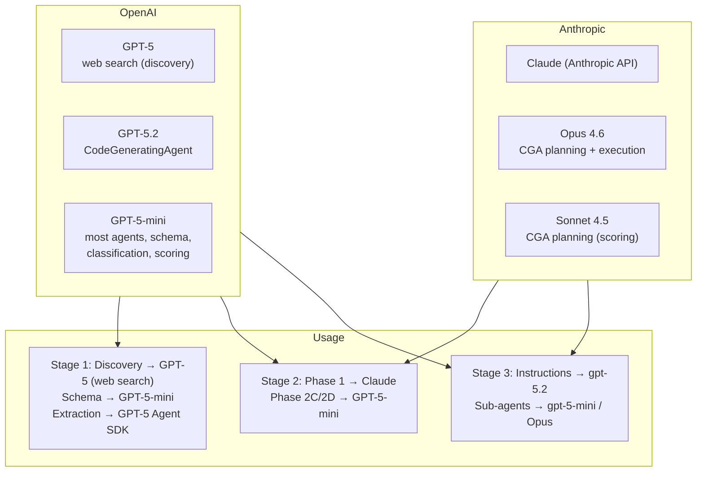

---

## 10. Rate Limiting Architecture

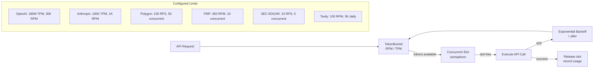

---

## 11. Backend API Layer

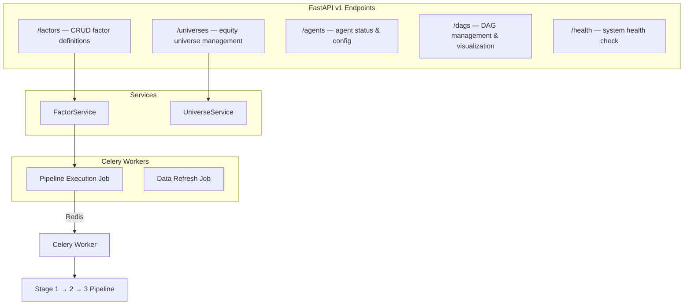

---

## 12. Workspace & Build

The project uses a **uv workspace** monorepo:

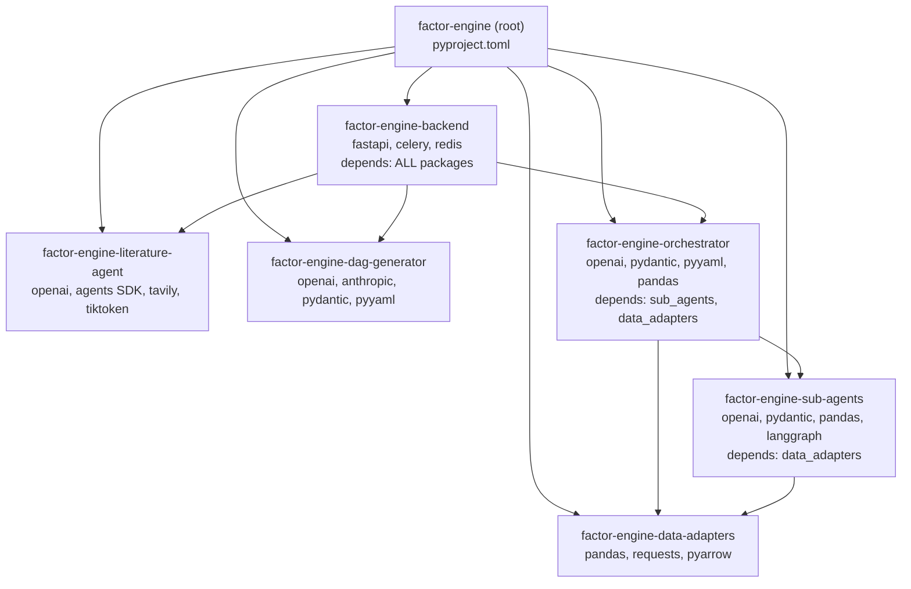

**Key commands** (`Makefile`):

| Command | Action |
|---------|--------|
| `make dev` | Install all packages |
| `make backend` | Start API (uvicorn :8000) |
| `make frontend` | Start Next.js dev |
| `make worker` | Start Celery worker |
| `make test` | Run all tests |
| `make lint` | Ruff checks + format |
| `make up / down` | Docker Compose |

---

## 13. Key Design Patterns

| Pattern | Where Used | Purpose |
|---------|------------|---------|
| **Reflection Loop** | CGA, Reshape, EventStudy | Generate → validate → fix → re-generate (max 3) |
| **Three-Phase LLM** | Classification, Scoring, Extraction | Infer schema → synthesize model → structured output |
| **Two-Call Architecture** | Phase 2C | Separate agent selection from artifact resolution |
| **Validation Pipeline** | DAG Generator | Validate → repair → revalidate adapter specs |
| **Artifact Registry** | Phase 2C, Orchestrator | Track outputs to resolve downstream inputs |
| **Token Bucket** | RateLimitManager | Per-service rate limiting with backoff |
| **Context-Result** | All sub-agents | Immutable context in, result out |
| **Manifest-Based I/O** | Orchestrator ↔ Agents | Agents emit flexible JSON manifests |
| **Checkpoint/Resume** | Orchestrator, Literature Agent | Persist state, skip completed stages |
| **Topological Scheduling** | DAG Engine, Phase 2C/2D | Kahn's algorithm for dependency-respecting order |
| **Singleton Registry** | AdapterContractLoader | Lazy-load YAML once, indexed access |

---

## 14. File Inventory by Package

| Package | Files | Lines (est.) | Role |
|---------|-------|-------------|------|
| `literature_agent` | ~25 | ~5K | Stage 1: theme → framework |
| `dag_generator` | 12 | ~4K | Stage 2: framework → DAG |
| `orchestrator` | ~30 | ~8K | Stage 3: DAG → execution |
| `sub_agents` | 39 | ~15K | 13 specialized agents |
| `data_adapters` | 17 | ~5K | 13+ data source adapters |
| `backend` | ~15 | ~2K | FastAPI + Celery |
| **Total** | **~138** | **~39K** | |
